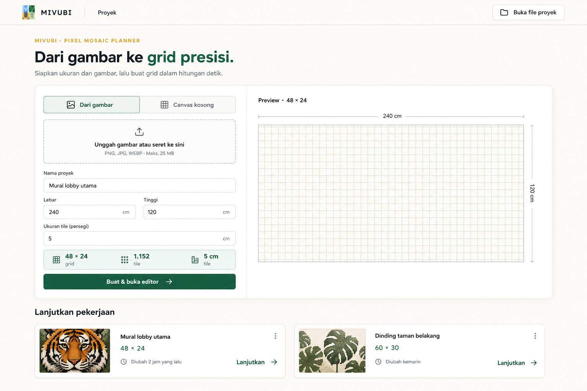
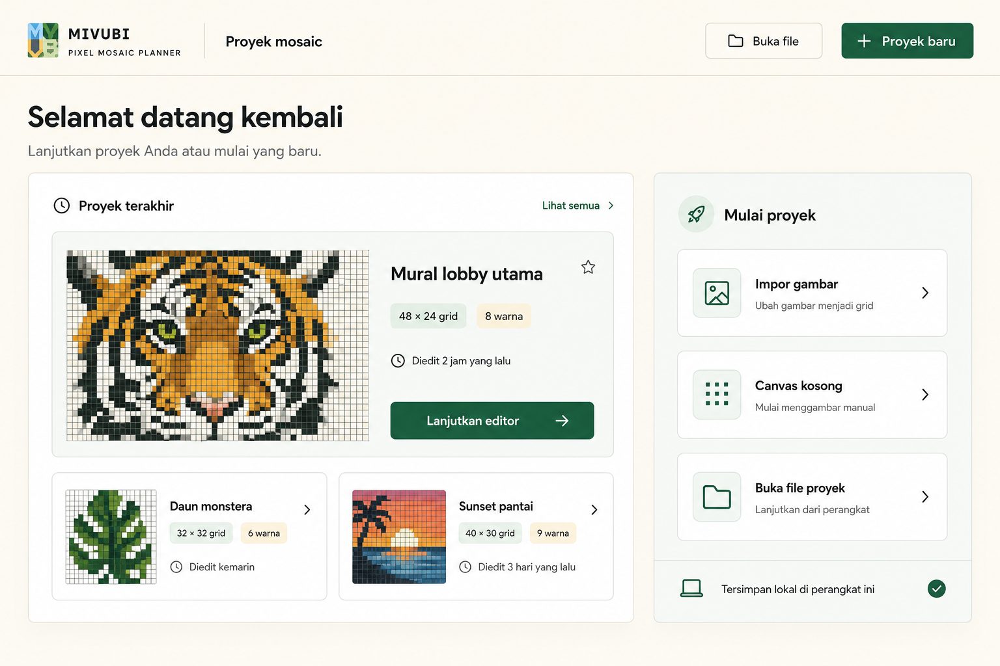
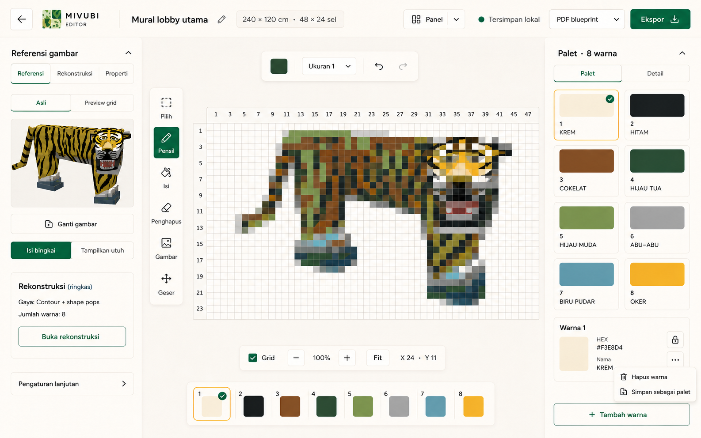
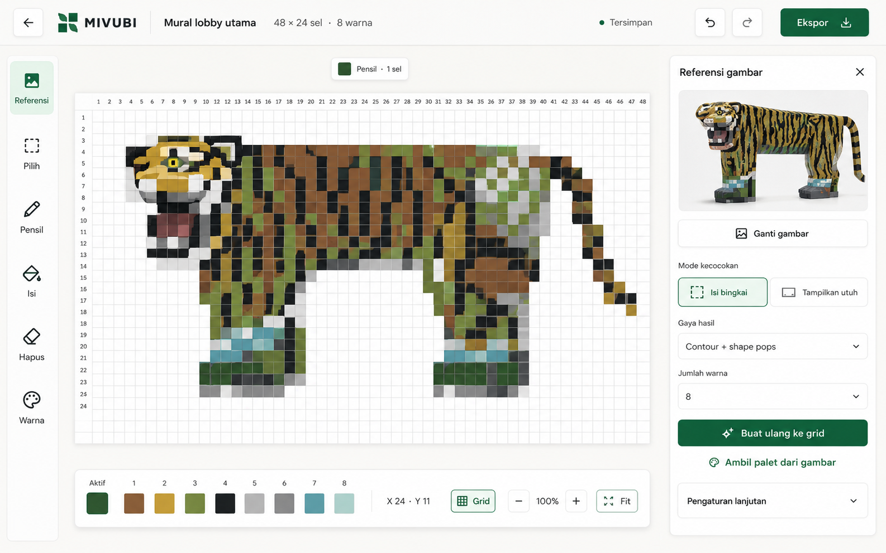

# MIVUBI UI/UX Redesign — Image References and Prompts

Paket ini berisi dua referensi Home dan dua referensi Editor. Fokus redesign adalah memperjelas hierarki, alur kerja, dan penggunaan ruang tanpa mengurangi fitur produk.

## Daftar file

| No. | File | Arah desain | Penggunaan yang disarankan |
| --- | --- | --- | --- |
| 01 | `images/01-home-quick-start-split.png` | Quick Start Split | Home utama untuk pengguna baru |
| 02 | `images/02-home-dashboard-first.png` | Dashboard First | Alternatif untuk pengguna yang sering melanjutkan proyek |
| 03 | `images/03-editor-focused-workbench-v2-panel-selector.png` | Focused Workbench v2 | Editor utama yang direkomendasikan |
| 04 | `images/04-editor-canvas-first-studio.png` | Canvas-first Studio | Alternatif atau mode fokus |
| — | `references/source-home.jpg` | Screenshot sumber | Referensi fitur dan identitas Home lama |
| — | `references/source-editor.jpg` | Screenshot sumber | Referensi fitur dan identitas Editor lama |

## Prinsip wajib

- Redesign UI/UX, bukan menghapus fitur.
- Fitur boleh dipindahkan ke tab, panel, drawer, accordion, dialog, atau menu kontekstual, tetapi tetap harus mudah ditemukan.
- Kanvas adalah fokus visual utama Editor.
- Bedakan `Impor gambar` untuk sumber artwork dan `Buka file proyek` untuk proyek tersimpan.
- Gunakan hijau sebagai aksi utama. Mustard hanya menjadi aksen, indikator, atau status.
- Gunakan spacing berbasis 8 px, teks isi minimal 14 px, dan target interaksi minimal 44 × 44 px.
- Saat panel Palet terbuka, quick palette tetap tersedia untuk pergantian warna cepat; panel Palet digunakan untuk pengelolaan detail.
- Destructive action seperti hapus warna ditempatkan di menu `...`, bukan selalu terlihat.

---

## Prompt 01 — Home: Quick Start Split



```text
Use case: ui-mockup
Asset type: high-fidelity desktop web app screen, shippable product UI reference
Input images: Image 1 is the existing MIVUBI Home screen; use it only as the brand, product, and feature reference. Generate a newly redesigned screen.
Primary request: Redesign the MIVUBI Pixel Mosaic Planner Home page as a very simple “Quick Start Split” experience that a first-time user understands immediately.
Composition/framing: full desktop application screenshot, 16:10 landscape, no browser chrome. Compact 64 px header. A compact hero, then the main working card immediately below. Use a 12-column grid and generous but efficient whitespace.
Layout:
- Header: small MIVUBI logo at left, nav label “Proyek”, secondary button “Buka file proyek” at right.
- Compact hero: eyebrow “MIVUBI · PIXEL MOSAIC PLANNER”, headline “Dari gambar ke grid presisi.” and one short supporting sentence.
- Main white rounded card with two columns. Left 40%: segmented tabs “Dari gambar” selected and “Canvas kosong”; a simple upload dropzone; fields “Nama proyek”, “Lebar”, “Tinggi”, “Ukuran tile”; compact summary “48 × 24 grid · 1.152 tile · 5 cm/tile”; one forest-green primary button “Buat & buka editor”.
- Right 60%: clear live grid preview with small header “Preview · 48 × 24”, physical dimension labels 240 cm and 120 cm, and a restrained pale grid.
- Directly below: section “Lanjutkan pekerjaan” with two useful recent-project cards, including “Mural lobby utama”, a small tiger pixel-mosaic thumbnail, “48 × 24”, last-edited metadata, and a clear “Lanjutkan” action.
Style/medium: realistic polished Figma-style product UI, not concept art; crisp modern sans-serif; accessible sizing.
Color palette: warm ivory #F7F4EA background, white cards, forest green #1F684A for primary actions, charcoal #19251F text, mustard #E4B93F only as a small accent, pale mint summaries.
Constraints: keep the MIVUBI identity; Indonesian UI text only; strong hierarchy; minimum readable body text; at most one primary button per section; subtle 1 px borders and very soft shadows; precise spacing; no watermark.
Avoid: giant hero, giant unused empty grid, tiny labels, duplicate actions, decorative illustrations, gradients, glassmorphism, mobile layout, device mockup, extra or garbled words.
```

---

## Prompt 02 — Home: Dashboard First



```text
Use case: ui-mockup
Asset type: high-fidelity desktop web app screen, shippable product UI reference
Input images: Image 1 is the existing MIVUBI Home screen; use it only as the brand, product, and feature reference. Generate a newly redesigned screen.
Primary request: Redesign the MIVUBI Pixel Mosaic Planner Home page as a simple “Dashboard First” workspace for returning users, while keeping project creation obvious.
Composition/framing: full desktop application screenshot, 16:10 landscape, no browser chrome. Compact header and a balanced two-column dashboard, with useful content above the fold.
Layout:
- Header: MIVUBI logo, page title “Proyek mosaic”, secondary button “Buka file”, forest-green primary button “Proyek baru”.
- Main heading “Selamat datang kembali” with short helper text, not a large marketing hero.
- Main content left 68%: “Proyek terakhir”. One large featured project card for “Mural lobby utama” with a clean tiger pixel-mosaic preview, tags “48 × 24 grid” and “8 warna”, edited-time text, and button “Lanjutkan editor”. Under it, two smaller recent project cards with simple grid thumbnails.
- Right 32%: a clearly separated card “Mulai proyek” with three large, easy choices in a vertical list: “Impor gambar” with helper “Ubah gambar menjadi grid”, “Canvas kosong” with helper “Mulai menggambar manual”, and “Buka file proyek” with helper “Lanjutkan dari perangkat”. Each choice uses a simple line icon and chevron, no competing primary buttons.
- A small local-status row at the bottom of the right card: “Tersimpan lokal di perangkat ini”.
Style/medium: realistic polished Figma-style desktop product UI, not concept art; crisp modern sans-serif; comfortable 14–16 px body text; cards that clearly look clickable.
Color palette: warm ivory #F7F4EA, white and pale mint surfaces, forest green #1F684A, charcoal #19251F, mustard #E4B93F used sparingly for selection or status.
Constraints: preserve the MIVUBI visual identity; Indonesian UI text only; clear returning-user flow; strong accessibility and contrast; 12-column layout; subtle borders and soft shadows; no watermark.
Avoid: full-page form, giant empty preview, oversized hero copy, tiny labels, duplicate import terminology, excessive yellow, gradients, glassmorphism, mobile layout, device mockup, extra or garbled words.
```

---

## Prompt 03 — Editor: Focused Workbench v2 + Panel Selector



Ini adalah arah Editor yang direkomendasikan. Dibanding versi pertama, v2 menambahkan pilihan panel dan mengembalikan fitur yang hilang tanpa mengorbankan fokus kanvas.

```text
Use case: ui-mockup
Asset type: high-fidelity desktop pixel-mosaic editor screen, shippable product UI reference
Input images: Image 1 is the existing MIVUBI editor and is the authoritative feature inventory reference. Generate a newly redesigned editor, not a simple reskin.
Primary request: Redesign the MIVUBI editor as “Focused Workbench v2”. Retain the familiar left-reference / center-canvas / right-palette model, make the canvas dominant, add a clear panel-selection system, and preserve every useful capability from the original editor. This is a UI/UX reorganization, not a feature-reduction exercise.
Composition/framing: full desktop application screenshot, 16:10 landscape, no browser chrome. Header 56 px, left panel about 270 px, large flexible center, right panel about 290 px.
Header:
- back arrow, compact MIVUBI logo, editable project name “Mural lobby utama”.
- metadata chip “240 × 120 cm · 48 × 24 sel”.
- compact control “Panel” with layout icon and chevron for showing or hiding left panel, right panel, and quick palette.
- status “Tersimpan lokal”.
- secondary format selector “PDF blueprint”.
- forest-green primary button “Ekspor”.
Panel-selection system:
- Left sidebar tabs: “Referensi”, “Rekonstruksi”, “Properti”; “Referensi” active.
- Right sidebar tabs: “Palet”, “Detail”; “Palet” active.
- Both sidebars have visible collapse controls.
- Features may move between tabs, drawers, accordions, dialogs, or overflow menus, but must not be deleted.
Left Referensi panel:
- one tiger source image only, with tabs “Asli” and “Preview grid”.
- action “Ganti gambar”.
- fit choice “Isi bingkai” and “Tampilkan utuh”.
- compact summary “Rekonstruksi (ringkas)” showing style and number of colors.
- button “Buka rekonstruksi”.
- “Pengaturan lanjutan” accordion.
Rekonstruksi panel behavior:
- include “Gaya hasil”, “Jumlah warna”, “Buat suggestion”, “Ambil palet dari gambar”, and “Terapkan ke grid”.
- keep generation and application as separate actions when they have different effects.
Center workspace:
- very large white numbered 48 × 24 grid showing the same recognizable side-view tiger as an eight-color pixel mosaic.
- one slim floating vertical toolbar with all tools: “Pilih”, “Pensil”, “Isi”, “Penghapus”, “Gambar”, “Geser”; Pensil active.
- contextual bar with active color, “Ukuran 1”, undo, and redo.
- canvas controls: Grid on/off, minus, percentage, plus, Fit, and coordinates “X 24 · Y 11”.
- compact bottom quick palette with active color and all eight swatches for fast painting.
Right Palet panel:
- overview “Palet · 8 warna” as eight roomy swatches.
- selected-color detail with number, HEX, editable name, lock, and overflow menu.
- overflow menu contains “Hapus warna” and “Simpan sebagai palet”.
- sticky button “+ Tambah warna”.
Style/medium: realistic polished Figma-style product UI, not concept art; crisp Indonesian labels; warm craft-studio visual identity; accessible text and 40–44 px controls.
Color palette: warm ivory #F7F4EA, white surfaces, charcoal #19251F, forest green #1F684A, mustard #E4B93F only as an accent; mosaic colors are separate content colors.
Constraints: preserve MIVUBI identity and tiger project; Indonesian UI text only; do not remove any original feature; controls may move but remain discoverable; canvas stays the visual focus; precise spacing; no watermark.
Avoid: simplifying by deleting features, duplicated full-size panels, tiny unreadable controls, giant dropdown covering the canvas, excessive gray dead space, gradients, glassmorphism, mobile layout, device mockup, extra or garbled words.
```

### Checklist fitur Editor yang tidak boleh hilang

- Referensi asli dan preview grid.
- Crop/fitting: Isi bingkai dan Tampilkan utuh.
- Rekonstruksi, suggestion, jumlah warna, dan penerapan ke grid.
- Ambil palet dari gambar.
- Pilih, Pensil, Isi, Penghapus, Gambar, dan Geser.
- Undo dan redo.
- Quick palette dan manajemen detail palet.
- Tambah, ubah nama/HEX, lock, hapus, dan simpan palet.
- Grid, zoom, Fit, dan koordinat sel.
- Status penyimpanan lokal.
- Pemilihan format dan Ekspor.
- Pilihan serta collapse panel.

---

## Prompt 04 — Editor: Canvas-first Studio



```text
Use case: ui-mockup
Asset type: high-fidelity desktop pixel-mosaic editor screen, shippable product UI reference
Input images: Image 1 is the existing MIVUBI Editor; use it as the brand, feature, tiger-reference, and workflow reference. Generate a newly redesigned editor, not a simple reskin.
Primary request: Redesign the MIVUBI editor as a modern “Canvas-first Studio” with a slim tool rail, one contextual inspector, and a huge unobstructed mosaic canvas. It must stay simple enough for a beginner and must not remove original features; inactive features move into contextual inspector tabs or menus.
Composition/framing: full desktop application screenshot, 16:10 landscape, no browser chrome. One 56 px header, a 68 px left tool rail, very large center workspace, one 320 px contextual inspector on the right.
Header: back arrow, compact MIVUBI mark, project name “Mural lobby utama”, metadata “48 × 24 sel · 8 warna”, green-dot status “Tersimpan”, undo, redo, format selector, and forest-green button “Ekspor”.
Left tool rail: vertically stacked icon buttons with concise labels or visible tooltip treatment: “Referensi” active, “Pilih”, “Pensil”, “Isi”, “Hapus”, “Gambar”, “Warna”. Active state uses both a pale-green background and a dark-green icon.
Center workspace:
- canvas uses about 70% of the available width.
- a very large white 48 × 24 numbered grid containing the same recognizable side-view tiger reconstructed as a clean eight-color pixel mosaic.
- pale warm workspace background with no unnecessary empty frames.
- a floating bottom dock combining active color and eight compact swatches, coordinate “X 24 · Y 11”, “Grid”, minus, “100%”, plus, and “Fit”.
- a tiny top contextual pill near the canvas reading “Pensil · 1 sel” with the active dark-green swatch.
Right contextual inspector:
- top tabs “Referensi”, “Rekonstruksi”, “Palet”, and “Properti”; show “Referensi” active.
- one tiger source image.
- button “Ganti gambar”.
- segmented fit mode “Isi bingkai” selected and “Tampilkan utuh”.
- fields “Gaya hasil” with “Contour + shape pops” and “Jumlah warna” with “8”.
- clear primary button “Buat ulang ke grid”.
- secondary action “Ambil palet dari gambar”.
- closed accordion “Pengaturan lanjutan”.
Style/medium: realistic polished modern desktop product UI, Figma-like clarity without copying Figma; crisp sans-serif; professional but friendly.
Color palette: very pale gray-green #F4F7F5 background, white surfaces, charcoal #17211D, strong green #16734A, pale mint #B9DFC9, mustard only as a tiny accent; mosaic colors separate from UI colors.
Constraints: preserve MIVUBI identity and tiger project; Indonesian UI text only; do not delete original features; canvas is the overwhelming focal point; clear active states that do not rely on color alone; 44 px interaction targets; concise labels; precise spacing; no watermark.
Avoid: two permanent wide side panels, duplicate top toolbars, tiny labels, excessive controls at top, gray dead space, gradients, glassmorphism, device mockup, mobile layout, extra or garbled words.
```

---

## Rekomendasi implementasi

Gunakan kombinasi berikut sebagai fondasi utama:

- Home: `01-home-quick-start-split.png`
- Editor: `03-editor-focused-workbench-v2-panel-selector.png`

`02-home-dashboard-first.png` cocok jika data penggunaan menunjukkan mayoritas pengguna datang untuk melanjutkan proyek. `04-editor-canvas-first-studio.png` cocok sebagai mode fokus atau arah jangka panjang setelah pengguna terbiasa dengan pola panel kontekstual.
